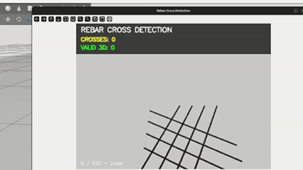

# Mikhail Krakhotin

### Machine Learning Engineer · Robotics Software Engineer · Computer Vision Engineer

---

## About Me

I am a **Machine Learning and Robotics Engineer** with a background in **Control Systems Engineering**.

My main areas of interest are **robotics, computer vision, machine learning, large language models, and intelligent autonomous systems**.

I mainly work with **Python and C++** and have experience developing robotic systems with **ROS 2**, building computer vision pipelines, training and integrating LLMs, and developing backend applications.

I enjoy working on complex engineering problems where **software, AI, and physical systems** come together.

---

## Experience

### Robotics Software Engineer — FeBot

**April 2024 – May 2026**

Worked on the development of a **mobile robotic platform with a manipulator and intelligent control systems**.

My responsibilities included:

* Developing robotic software using **Python, C++ and ROS 2**
* Developing control systems for a mobile robotic platform and manipulator
* Training and integrating **LLaMA 3.1 8B** for natural-language robot control
* Converting high-level commands into sequences of robotic actions
* Developing computer vision algorithms using **OpenCV**
* Object detection, segmentation and recognition
* Implementing obstacle avoidance and road-following algorithms
* Working with **URDF, Gazebo and RViz**
* Integrating software between simulation and real robotic hardware
* Optimizing robotic models and control pipelines
* Developing systems for object detection and manipulation

  

[**→ More about FeBot**](projects/)

---

### Robotics & Computer Vision

I have worked on several robotics projects involving **computer vision, autonomous systems, robotic manipulation and motion planning**.

One of the main projects is a **6-DOF robotic system for automated welding of reinforcement structures**.

The system combines RGB/depth cameras, computer vision, ROS 2 and robotic motion planning to detect reinforcement bars and provide the information required for robotic manipulation.

#### Technologies

* **ROS 2 Jazzy**
* **Gazebo Harmonic**
* **Intel RealSense D435**
* **DeepLabV3Plus**
* **Skeletonization**
* **RANSAC**
* **MoveIt 2**
* **OpenCV**
* **Python**
* **C++**

[**→ More about Arctos Rebar-Cross**](projects/)

---

### AI & Backend Development

I also develop **AI-powered backend applications** using modern Python technologies.

One of my projects is an **AI-powered cybersecurity digest** that collects security publications, removes duplicates, analyzes articles using an LLM, determines relevance and importance, and generates structured reports.

#### Technologies

* **Python**
* **FastAPI**
* **asyncio**
* **Pydantic**
* **SQLAlchemy**
* **PostgreSQL**
* **Alembic**
* **Docker**
* **RabbitMQ**
* **Redis**
* **LLM APIs**

[**→ More about IT Security Digest**](projects/)

---

## Education

### Saint Petersburg Electrotechnical University "LETI"

**B.Sc. in Control Systems Engineering**

Currently pursuing a **Master's degree** in a related engineering field.

My academic background combines:

* Control systems
* Robotics
* Programming
* Computer vision
* Machine learning
* Automation

---

## Technical Skills

### Programming

`Python` · `C++` · `SQL`

### Machine Learning & AI

`LLaMA` · `Hugging Face Transformers` · `TensorFlow` · `scikit-learn`

### Computer Vision

`OpenCV` · `DeepLabV3Plus` · `Object Detection` · `Image Segmentation` · `Image Processing`

### Robotics

`ROS 2` · `Gazebo` · `RViz2` · `MoveIt 2` · `URDF` · `SLAM` · `Robotic Manipulation`

### Backend

`FastAPI` · `Pydantic` · `SQLAlchemy` · `asyncio` · `PostgreSQL` · `REST APIs`

### Infrastructure & Tools

`Linux` · `Docker` · `Git`

### Data

`NumPy` · `Pandas` · `PySpark`

---

## Projects

### FeBot

Mobile robotic platform with a manipulator and LLM-based natural-language control.

[**→ Project details**](projects/)

### Arctos Rebar-Cross

Computer vision and ROS 2 pipeline for reinforcement bar detection and robotic manipulation.

[**→ Project details**](projects/)

### IT Security Digest

AI-powered system for collecting, analyzing and summarizing cybersecurity publications.

[**→ Project details**](projects/)

### Robotic Greenhouse Harvester

ROS 2-based robotic system for detecting and harvesting greenhouse crops.

[**→ Project details**](projects/)

### Visual Novel

An original **Godot-based visual novel** with interactive storytelling and local two-player mechanics.

[**→ Project details**](projects/)

---

## Interests

* Robotics and autonomous systems
* Machine Learning
* Computer Vision
* Large Language Models
* AI Agents
* Human-Robot Interaction
* Robotic Manipulation
* Software Engineering

---

## Contact

Feel free to contact me if you are interested in **robotics, machine learning, computer vision, AI or software engineering**.

